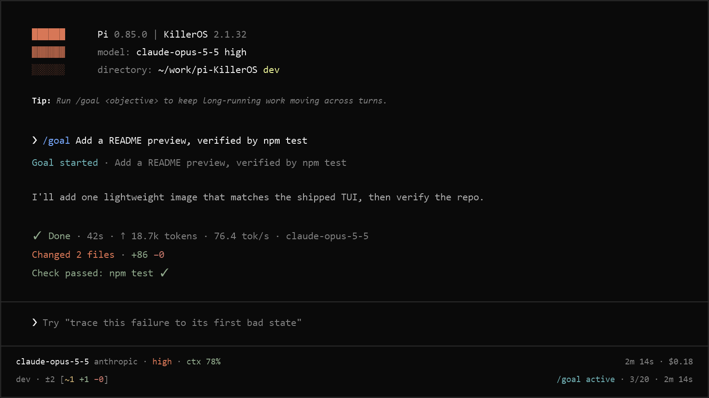

# KillerOS

A TypeScript extension for the [Pi coding agent](https://github.com/earendil-works/pi) that replaces the stock TUI and adds long-running goals, reasoning controls, and workflow commands.



## What you get

- A custom TUI: startup masthead with versions, model, working directory, and Git branch; a dark theme with coral accents; a multiline editor with slash-command completion; a footer that tracks model, context, and goal state; settled task receipts with duration and token usage.
- `/goal`: set an objective and Pi keeps working toward it across turns, compaction, reloads, and branch navigation. Each turn must record `continue` with evidence and one next action, `complete`, or the existing blocker decision; otherwise the goal pauses. New goals pause after 20 turns; `/goal resume` grants another 20.
- `/codex-fast`: toggles the `priority` service tier on legacy Codex and eligible native OpenAI Responses requests or reports its status.
- `/handoff`: starts a fresh linked session carrying visible continuation context.
- `/auto-compact`: reports, enables, disables, or tunes automatic context compaction.
- A `question` tool with single-select and multi-select modes.
- Lifecycle hooks (`tool_call`, `tool_result`, `agent_settled`) from `.pi/killeros-hooks.json`, plus `AGENTS.local.md` loading for trusted projects.
- Optional completion sounds for settled requests.


## Requirements

- Node.js 22.19.0+
- Pi 0.99.2 or later below 2.0.0
- An interactive TUI session for the custom header, editor, footer, and `question`

## Install

```bash
pi install npm:killeros
```

Or from GitHub:

```bash
pi install git:github.com/KyrosHendrix/pi-KillerOS
```

Pin a release by appending its tag, for example `@v3.0.0`. Add `-l` to install only for the current project. Restart Pi after installing.

## Commands

```text
/goal                     View the current goal
/goal <objective>        Set an objective
/goal pause               Stop automatic continuation
/goal resume              Resume automatic continuation
/goal clear               Remove the current goal
/codex-fast [status]      Toggle or report Codex fast mode
/auto-compact [status|on|off|<percent>]
                          Inspect or change automatic compaction
/notification             Configure the completion sound
/handoff [focus]          Fresh session with continuation context
/clear                    New session after confirmation
/exit                     Quit Pi gracefully
```

Fast mode is off by default. `/codex-fast` toggles it, and `/codex-fast status` reports the preference without changing it. The preference stays in the current Pi process across model switches and extension reloads, but is not saved between processes. The command name and notification strings retain their legacy Codex wording.

Fast mode applies to legacy `openai-codex` requests and selected native models with provider `openai`, API `openai-responses`, and base URL `https://api.openai.com/v1`, with an optional trailing slash. Native request payloads must also name the selected model's exact ID. Both API-key and ChatGPT subscription authentication use this rule. Custom endpoints, Azure, other APIs, and ambiguous native requests pass through unchanged. When enabled, fast mode overrides an eligible request's existing service tier with `priority`; when disabled, it leaves the request unchanged.

The TUI footer's `fast` label means the enabled preference applies to the selected model, not that OpenAI accepted priority service. OpenAI controls account and model eligibility, the actual service tier, and charges. Priority can affect billing; subscription login does not guarantee accepted or free priority service. KillerOS leaves provider errors to Pi and does not silently retry with a different tier.

## Behavior by mode

Pi 1.0 defaults to fullscreen. Use `--tui-mode regular` for one invocation or set `"tuiMode": "regular"` in Pi's [settings](https://github.com/earendil-works/pi/blob/main/packages/coding-agent/docs/settings.md#terminal-and-display) to restore terminal-owned scrollback. KillerOS leaves Pi's `tuiMode` and `quietStartup` preferences unchanged.

| Mode | What works |
| --- | --- |
| TUI | Everything |
| RPC | Goals, proactive compaction; no TUI components, sounds, title indicator |
| Print/JSON | No interactive questions, `/goal`, or proactive compaction |

`question` and the active `killeros_goal_update` tool use Pi's `model-only` exposure. They stay directly declared to the model when codemode is disabled or enabled in `on` or `only` mode, but scripts and other tools cannot call them through `ctx.executeTool()`. The goal tool remains inactive without an active goal. Questions still require TUI mode; a direct RPC call fails with `The question tool requires interactive TUI mode`. KillerOS does not enable or configure codemode.

## Configuration

The packaged `killeros` theme activates on TUI start. Compaction triggers by default at 15% tokens remaining, stored in global `killeros.json`:

```json
{
  "autoCompaction": {
    "enabled": true,
    "percentRemaining": 15
  },
  "handoffMaxTokens": 8192
}
```

Use `/auto-compact status` to inspect the effective KillerOS preference, `/auto-compact on` or `/auto-compact off` to toggle it, and `/auto-compact <percent>` to set an integer threshold from 0 through 100. A threshold of 0 does not disable Pi's own token reserve.

Concurrent `/auto-compact` commands preserve independent changes to the enabled flag and threshold, along with unrelated settings. Malformed settings and failed writes report an error without claiming success or replacing the original file.

`handoffMaxTokens` caps the `/handoff` summary output at 8192 tokens by default; raise it when long sessions truncate the summary. The handoff is saved as a visible user-context message before success is reported, so the linked session survives immediate exit and resume without sending another prompt. Creating the handoff does not start an agent turn.

State proof in the objective so the agent can verify it with its normal tools:

```text
/goal Reduce p95 checkout latency below 120 ms, verified by the checkout benchmark, while keeping the correctness suite green
```

A direct quoted path-shaped file target binds silent file proof. For an extensionless relative file, use an explicit path such as `./summary` or `.\summary`:

```text
/goal Fix `killeros/footer.ts`, verified by npm test
```

Bare quoted prose remains model-reported. KillerOS captures the file baseline at goal start and only completes when the file is created or changed. A normal response never continues a goal by itself: the agent must record `continue`, `complete`, or a blocker decision through `killeros_goal_update`. Repeated continuation reports and unavailable goal tools pause the goal. New goals pause after 20 turns without warning. An explicit `/goal resume` on an exhausted goal grants another 20 turns; compaction recovery never grants turns. Same-turn recovery requires an actual interruption; successful or skipped compaction cannot restart a normally stopped goal without a decision. Restored goals keep their persisted limit.

Session replacement, reload, and committed tree navigation discard unfinished task receipts. Late receipt results do not write or notify through the old session context or attach to a different branch. Cancelled navigation preserves the pending receipt.

Pending `/goal` commands discard their mutation if committed navigation changes the branch or another mutation changes the goal while confirmation, idle waiting, or file-baseline reading is in progress. Cancelled navigation preserves valid pending commands. Discarding a stale replacement after its idle wait preserves the surviving goal's authorized continuation.

Failed Git metadata reads keep the footer's last successful file counts and mark task changes unavailable. They are not treated as an empty repository.

Completion sounds are off by default; change with `/notification` in TUI mode. The tab-title indicator requires a Nerd Font.

## Development

Strict TypeScript throughout. Tests run on Node's built-in test runner:

```bash
npm ci && npm run check && npm test
```

Releases go through CI on `main`; do not push version tags manually. The prepublish check rejects ordinary direct `npm publish`, but `--ignore-scripts` can bypass it. Configure npm's trusted publisher for `release.yml`, set package publishing access to "Require two-factor authentication and disallow tokens", and revoke unused publish tokens. npm maintainers can still publish interactively with 2FA, so workflow-only publishing also depends on maintainer policy.

## Security

Pi extensions run with your user permissions. Review the source before installing globally. Hook commands run only for projects Pi marks as trusted; check `.pi/killeros-hooks.json` before enabling project trust. KillerOS accepts that configuration only as a regular, non-linked file no larger than 64 KiB in the project's real `.pi` directory.

Handoff validation rejects recognized credential assignments in plain text, Markdown lists, bold labels, and inline-code labels before creating a destination session. This pattern check cannot detect every secret or personally identifying value. Rejected values are not included in the error notification.

## License

[MIT](LICENSE) © 2026 KyrosHendrix
